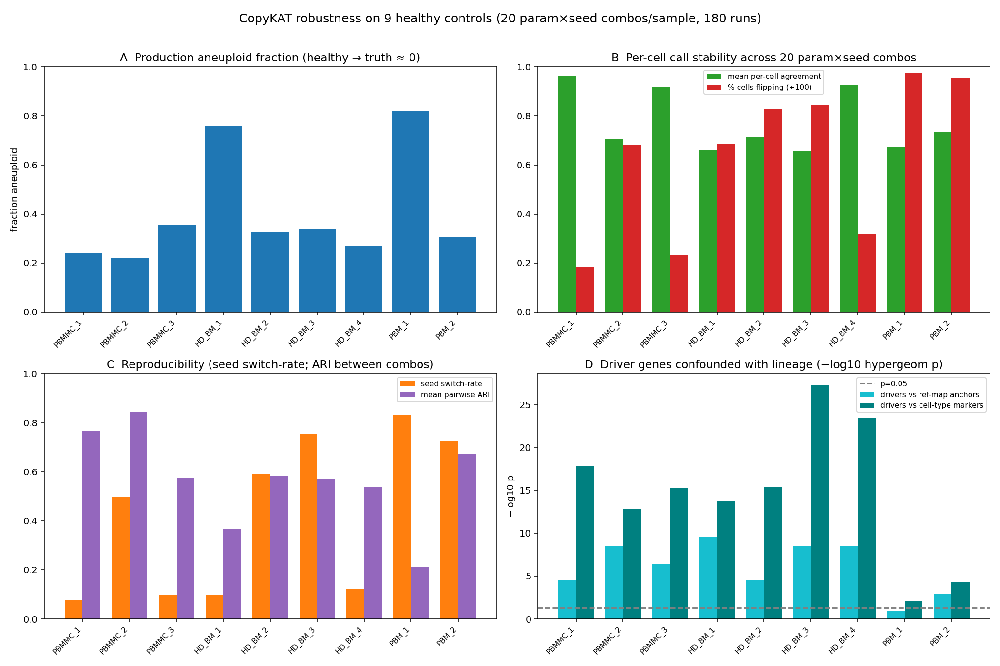
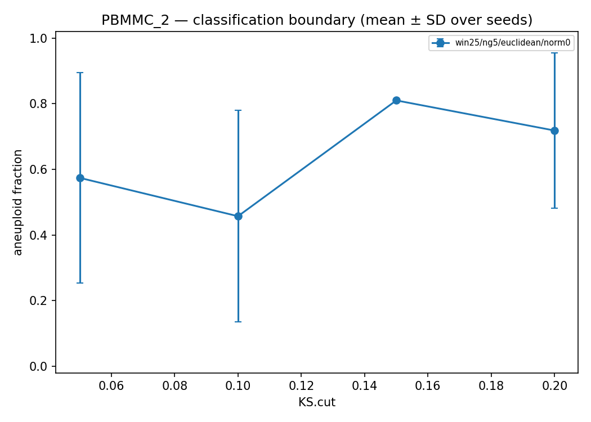
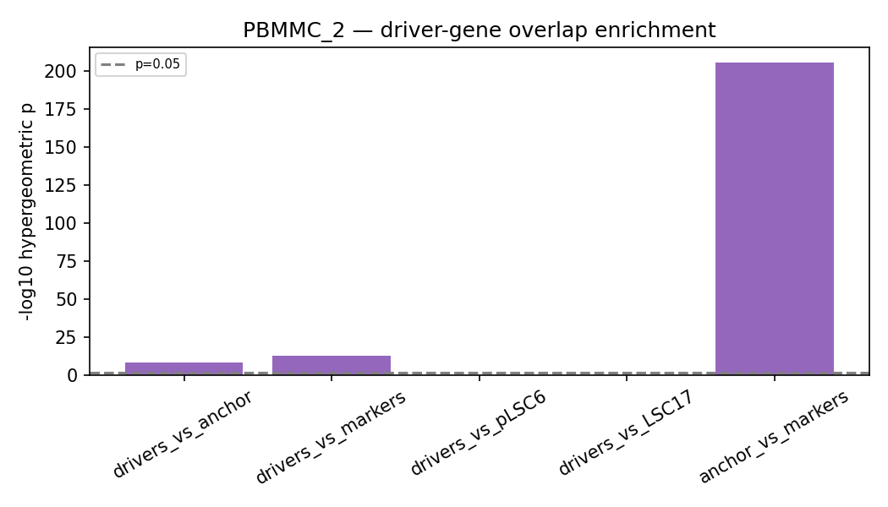

# 02 — CopyKAT robustness / reliability on healthy controls

## Question / goal

**How trustworthy is a CopyKAT "aneuploid" call?** Prompted by PBMMC_2 in the first control run
([[2026-06-04_first-real-run-caron-controls]]), where CopyKAT labelled 2,830 / 3,491 healthy cells
"aneuploid" with no tumour present. Before CopyKAT can act as an aneuploidy gate on patient data
([[2026-06-09_patient-cohort-runs]]), quantify on a true-normal cohort: (1) how variable is the
aneuploid fraction, (2) which genes/regions drive the call, (3) do those drivers correspond to real
biology (erythroid/ribosomal expression) rather than copy number, and (4) how stable is the call to
CopyKAT's own randomness/parameters (seed + `KS.cut`/`win.size`/`ngene.chr`/`distance` sweep).

## Data & provenance

9 GEX-only healthy controls from three independent 10x datasets — the cohort built in
[[2026-06-08_controls-full-cohort]]. All raw FASTQ → Longship under the controls snapshot; CopyKAT
production calls consumed from `results_controls/copykat/<sample>/<sample>_copykat_prediction.txt`.

| Sample | Dataset (SRA) | Modality | Tool outputs consumed |
|---|---|---|---|
| PBMMC_1-3 | Caron 2020 GSE132509 (SRR9264351/3/4) | GEX | copykat prediction + CNA matrix; reference_mapping celltypes |
| HD_BM_1-4 | healthy BM (SRR12185508-511) | GEX | as above |
| PBM_1-2 | healthy PBMC (SRR12338699-…) | GEX | as above |

Anchors for the cross-reference: the DDE_32 paediatric BM atlas
(`bone_marrow_atlas.h5ad`) PCA-loading genes + `rank_genes_groups` markers (wilcoxon), and the
pLSC6 / LSC17 leukaemic-stem gene sets (atlas gene sets cached to JSON by `copykat_crossref.py`).

## Method

Hybrid design (plan `.claude/plans/ticklish-herding-wilkinson.md`): a gated Nextflow sweep
subworkflow + four standalone Python analyses. Runs logged in [[2026-06-08_controls-full-cohort]].
Tool: [CopyKAT](https://github.com/navinlabcode/copykat) (R 4.5.3, `snv` conda env).

**1. Stability sweep** — `bin/copykat_sweep.R` (generalised `copykat.R` with `set.seed()` +
`KS.cut`/`win.size`/`ngene.chr`/`distance`/`norm.cell.names` grid); `COPYKAT_SWEEP` module fans the
cross-product per sample (default 20 combos × 9 = **180 CopyKAT runs**). `copykat_stability.py`
computes consensus call, seed switch-rate, ARI between combos, and a boundary curve.

**2/3/4. Standalone characterisation** (`bin/`, `aml_scrna` conda):
`copykat_drivers.py` (per-gene/region aneuploid-vs-diploid |Δ| + variance),
`copykat_crossref.py` (drivers vs atlas anchors/markers + pLSC6/LSC17; hypergeometric + Jaccard),
`copykat_celltype_matrix.py` (cell type × chrom mean/variance + aneuploid fraction per type).

```bash
# Sweep (180 CopyKAT runs; reuses cached CellRanger, only COPYKAT_SWEEP runs)
sbatch jobs/run_controls_robustness.sh   # -profile viking --run_copykat_robustness (other callers off)
# Downstream characterisation over the existing production CopyKAT
sbatch jobs/run_copykat_robustness.sh    # exports PROJECT/bin to PATH (bin/ only on PATH inside NF tasks)
```

## Results

Sweep complete: 180 CopyKAT runs (20 combos × 9 samples) + downstream stability published. Full
per-sample summary figure and the four sub-findings below; numbers from
`results_controls/copykat_robustness/_analysis/robustness_summary_table.csv`.



| Sample | aneuploid frac | mean agreement | % cells flip | seed switch-rate | mean ARI | drivers∩markers p | drivers∩anchor p |
|---|---|---|---|---|---|---|---|
| PBMMC_1 | 0.24 | 0.96 | 18% | 0.075 | 0.77 | 1.6e-18 | 2.9e-05 |
| PBMMC_2 | 0.22 | 0.71 | 68% | 0.498 | 0.84 | 1.5e-13 | 3.3e-09 |
| PBMMC_3 | 0.36 | 0.92 | 23% | 0.098 | 0.57 | 5.7e-16 | 3.8e-07 |
| HD_BM_1 | 0.76 | 0.66 | 69% | 0.099 | 0.37 | 2.1e-14 | 2.6e-10 |
| HD_BM_2 | 0.33 | 0.72 | 83% | 0.590 | 0.58 | 4.2e-16 | 2.7e-05 |
| HD_BM_3 | 0.34 | 0.66 | 85% | 0.755 | 0.57 | 6.1e-28 | 3.3e-09 |
| HD_BM_4 | 0.27 | 0.93 | 32% | 0.123 | 0.54 | 3.4e-24 | 3.0e-09 |
| PBM_1 | 0.82 | 0.68 | 98% | 0.834 | 0.21 | 8.8e-03 | 1.2e-01 (ns) |
| PBM_2 | 0.30 | 0.73 | 95% | 0.725 | 0.67 | 5.0e-05 | 1.3e-03 |

### 1. The call is not reproducible — seed alone flips cells (panels B/C)

Across the 20 param×seed combos, **18–98% of cells change aneuploid/diploid class** (`% cells flip`).
Even holding all parameters fixed and varying *only the random seed*, the per-parameter **seed
switch-rate** reaches **0.83 (PBM_1), 0.76 (HD_BM_3), 0.59 (HD_BM_2)** — i.e. on the worst samples a
majority of cells get a different call from one seed to the next. Mean pairwise **ARI** between combos
is **0.21–0.84** (1.0 = identical); PBM_1 at 0.21 is essentially a coin-flip relabelling. Only
PBMMC_1, PBMMC_3, HD_BM_4 are reasonably stable (agreement ≥ 0.92). The boundary curves
(`*_copykat_boundary_curve.png`) are **non-monotonic** in `KS.cut` — e.g. PBMMC_2 aneuploid fraction
0.57 → 0.46 → 0.81 → 0.72 across `KS.cut` 0.05/0.1/0.15/0.2 — so the headline parameter does not
behave as a smooth threshold and there is no clean operating point.

A second, accidental replicate underlines this: re-running the *default* production CopyKAT during
the sweep orchestrator (cache miss, see caveats) re-drew every call. PBMMC_2 went from **2,830/3,491
aneuploid (81%) on 2026-06-08 to 765/3,491 (22%) on the 2026-06-09 re-run** with identical default
parameters — a 4× swing from CopyKAT's stochastic baseline alone.



### 2. Aneuploid fraction is high and dataset-inconsistent on healthy cells (panel A)

On these true-normal controls CopyKAT calls **22–82%** of cells "aneuploid" (truth ≈ 0%), with no
stable baseline: PBM_1 82%, HD_BM_1 76% at the high end; PBMMC_2 22%, PBMMC_1 24% at the low end —
**same tissue, opposite calls** (HD_BM_1 76% vs HD_BM_4 27%). A raw aneuploid fraction cannot, on its
own, flag a malignant sample.

### 3. The "aneuploid" axis tracks erythroid / haemoglobin expression, not copy number (panel D)

`copykat_crossref.py` (`*_copykat_crossref_overlap.csv`): in **8/9 samples** the top-200 CopyKAT
drivers are significantly enriched for atlas **cell-type marker genes** (hypergeom p down to
**6.1e-28**, HD_BM_3) and for the reference-mapping **PCA anchor genes** (p down to **2.6e-10**) —
i.e. CopyKAT's malignancy axis overlaps the very genes that define lineage/cell-type. For PBMMC_2 the
marker overlap is **31 genes** (p = 1.5e-13), anchor overlap **12 genes** (p = 3.3e-9), dominated by
**haemoglobin + erythroid/ribosomal** transcripts: `HBA1, HBA2, HBB, HBM, HBQ1, GYPA, GYPB, KLF1,
PRDX2, RPS2, RPS3A, RPS8`. Its top per-chrom drivers sit on **chr16p** (`NME3, MRPS34, HBA1, HBA2`).
PBM_1 is the lone non-enrichment (anchor p = 0.12 ns) — and is also the *least* stable sample (ARI
0.21), so its drivers are noise rather than a clean lineage axis. So the expression-derived CNA signal
separating "aneuploid" from "diploid" is **erythroid lineage expression**, a known CopyKAT confound on
BM/PBMC, not true aneuploidy. (`copykat_drivers.py` reports one Δ per chromosome group — read at arm
resolution.)



### 4. Aneuploid calls are NOT enriched for leukaemic-stem programs

PBMMC_2 (and the cohort) drivers vs **pLSC6** and **LSC17** overlap = **0** (Jaccard 0, p = 1.0) — the
healthy over-call is not picking up an LSC-like signature, so it won't masquerade as malignant stem
signal downstream. This is the cross-check that lets CopyKAT stay in the pipeline as a *gate* read
alongside Numbat, not as a standalone clone caller. `copykat_celltype_matrix.py` confirms the
over-call concentrates in lineages with high lineage-specific expression (per-type aneuploid-fraction
barplots, `*_copykat_celltype_aneuploid.png`) rather than spreading uniformly.

## Interpretation

CopyKAT's aneuploid/diploid label on this data is **an unstable, expression-contrast axis, not a
calibrated copy-number call**: on healthy BM/PBMC it over-calls aneuploidy (up to 82%), the call is
driven by erythroid/ribosomal/haemoglobin expression (overlapping the lineage/anchor genes in 8/9
samples), it is inconsistent across donors of the same tissue, and — the new headline — it is **not
reproducible**: up to 98% of cells flip across a parameter×seed sweep and the call swings 4× (PBMMC_2
81%→22%) on identical default parameters from the random baseline alone.
**Operational conclusion:** never treat a CopyKAT per-cell call as a hard label. Use it only as a
*soft, sample-level* aneuploidy gate cross-checked against Numbat (the primary clonal axis) and
souporcell, and on patient runs (a) fix `set.seed()` for reproducibility, (b) supply a
**known-normal baseline** (`norm.cell.names` from `reference_mapping` celltypes — the
`COPYKAT_NORM_BARCODES` arm) instead of CopyKAT's automatic baseline, and (c) prefer a **consensus
call over seed replicates** (the `copykat_stability.py` consensus + agreement score) rather than a
single run.

## Limitations / caveats

- **The sweep re-drew the production CopyKAT calls.** The sweep orchestrator (Slurm **34565386**,
  COMPLETED 9h37m) ran with `-resume` but the production `COPYKAT` task missed cache (the combined
  9-sample samplesheet `controls_samplesheet_all9.csv` changed task staging vs the original
  batch1/batch2 runs), so it re-ran for all 9 and **overwrote** `results_controls/copykat/<s>/` with
  fresh stochastic draws (mtimes 2026-06-09 19:56–23:56). All numbers here are the re-drawn calls; the
  original 06-08 draws ([[2026-06-08_controls-full-cohort]], 21–72%) differ — itself evidence of the
  instability, but it means the cohort numbers in that session no longer match the files on disk.
- **No matched normal in the production calls.** These use CopyKAT's automatic baseline; the
  `norm.cell.names` arm (`COPYKAT_NORM_BARCODES`, `copykat_robustness_use_norm_ref`) is wired and
  stub-validated but was **not** enabled in this run (`use_norm_ref=[false]`) — quantifying whether a
  supplied baseline fixes the over-call is the next sweep.
- **Boundary is non-monotonic in `KS.cut`** — the parameter does not act as a clean threshold, so the
  curves locate instability rather than a recommended operating point.
- **Healthy-only baseline.** Conclusions are about CopyKAT's *false-positive* behaviour; sensitivity on
  true aneuploid clones is characterised on the patient cohort ([[2026-06-09_patient-cohort-runs]]), not
  here.
- **Driver resolution is per-chrom-arm**, not per-gene (shared Δ within an arm) — read accordingly.
- **`reference_mapping` is `scanpy.tl.ingest`** (v1 label transfer); celltype-resolved fractions inherit
  its mapping confidence.

## Links

- Produced by: [[2026-06-10_copykat-robustness-sweep]] (the sweep + downstream run worklog + job IDs)
- Feeds: [[2026-06-09_patient-cohort-runs]] (CopyKAT-as-gate decision applies on patient data)
- Depends on: [[2026-06-08_controls-full-cohort]] (9-control cohort + production CopyKAT),
  [[2026-06-04_first-real-run-caron-controls]] (the PBMMC_2 over-call that prompted this)
- Figures: `docs/lab_book/assets/02_copykat_robustness/` (committed); full per-sample outputs
  `results_controls/copykat_robustness/_analysis/`
- Code: DDE_33 `main`@7b57c25 **+ uncommitted working tree** (robustness track) · `bin/copykat_sweep.R`,
  `bin/copykat_{stability,drivers,crossref,celltype_matrix}.py`, `subworkflows/local/copykat_robustness.nf`,
  `jobs/run_controls_robustness.sh` · plan `.claude/plans/ticklish-herding-wilkinson.md`
