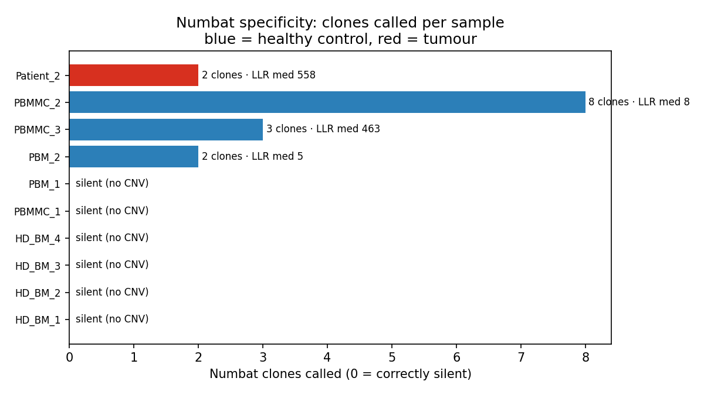
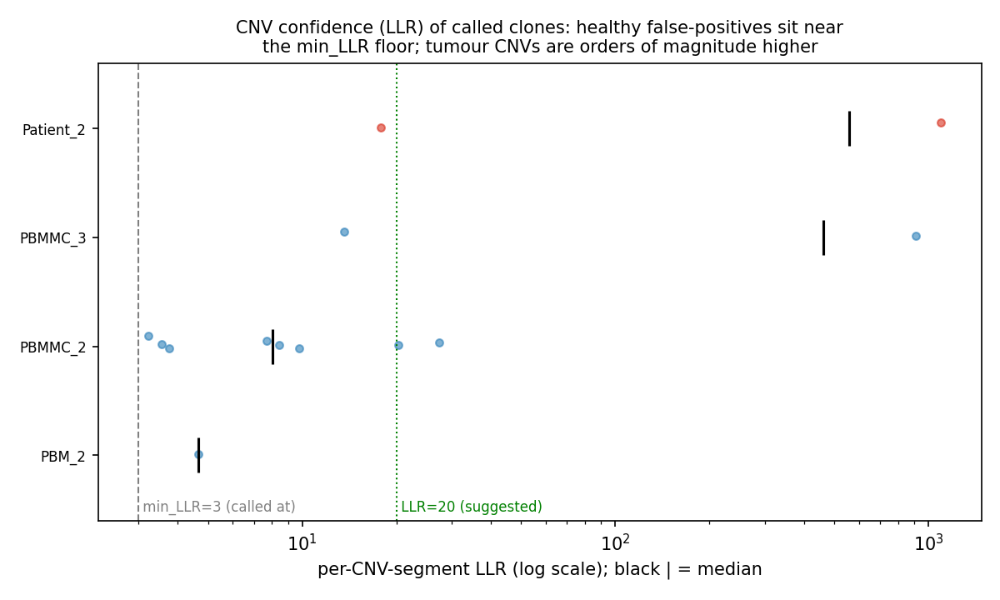

# 03 — Numbat specificity / false-positive behaviour on healthy controls

## Question / goal

The specificity counterpart to the CopyKAT robustness work ([[02_copykat_robustness]]). CopyKAT
over-calls aneuploidy on true-normal cells (22–82%, an unstable expression-contrast axis). **Does
Numbat — the primary clonal axis — do better?** On the same 9 healthy controls: (1) does the joint
clone caller correctly stay *silent* (call no clones) when there is no tumour, (2) when it does emit
clones on healthy cells, how confident (CNV LLR) are those calls, (3) are the false-positive clones
lineage-confounded (erythroid) the way CopyKAT's drivers are, and (4) is there a threshold that
separates the healthy over-calls from a real tumour clone. Motivated by the 2026-06-12 meeting note
*"a lot of the time it's not finding anything in healthy"* — quantify that.

## Data & provenance

Numbat joint runs (`run_numbat()`, relaxed `max_entropy=0.8`, `min_LLR=3`, `max_iter=2`, hg38) over
the 9 GEX-only healthy controls from [[2026-06-08_controls-full-cohort]] plus the one tumour with a
completed `numbat_out` as a positive comparator:

| Group | Samples | Numbat outputs consumed |
|---|---|---|
| healthy | PBMMC_1-3, HD_BM_1-4, PBM_1-2 (Caron 2020 GSE132509 + healthy BM/PBMC) | `numbat_joint/<s>/numbat_out/{segs_consensus_*,clone_post_*}.tsv` |
| tumour | Patient_2 (Sample_2977 Dx + Sample_0109 Rel, joint) | as above |

Celltype overlay from `reference_mapping/<s>/<s>_celltypes.csv` (`scanpy.tl.ingest` onto the DDE_32
paediatric BM atlas). **Comparator caveat:** only Patient_2 had finished `NUMBAT_RUN` at analysis
time — Patient_1 and all 10 DDE_22 patients were still pileup-only (`numbat_out/` absent), so the
positive class is n=1. Conclusions about *specificity* (the healthy false-positive rate) are solid;
the tumour LLR scale is anchored on a single patient and should be re-confirmed as the cohort
completes.

## Method

`bin/numbat_specificity.py` (`aml_scrna` conda) parses every `numbat_joint/<s>/numbat_out/` under
each results dir and classifies the sample:

- **SILENT** — no `segs_consensus_*.tsv`: Numbat filtered out every CNV and emitted no clone
  posteriors (the `log.txt` "No CNV remains after filtering by LLR in pseudobulks" path; all chrom
  arms declared diploid). This is a *correct negative* on a healthy sample.
- **CALLED** — reads the latest `segs_consensus_*.tsv` (per-CNV `cnv_state_post`, `LLR`,
  `seg_length`) and `clone_post_*.tsv` (per-cell `clone_opt`, `p_cnv`): n_clones, aneuploid fraction
  (cells in a non-reference clone with `p_cnv>0.5`), per-CNV LLR distribution, CNV span, and an
  erythroid fraction of the aneuploid cells (cell types matching `eryth|erythro|HBG|GYPA|MEP…`) — the
  CopyKAT lineage-confound test from analysis 02.

```bash
# off the existing single Numbat runs — no Viking / no re-run needed
python3 bin/numbat_specificity.py --out-dir results_controls/numbat_specificity \
    --results healthy=results_controls --results tumour=results_patients
```

## Results

`results_controls/numbat_specificity/numbat_specificity_summary.csv`.

| Sample | group | status | n_clones | aneuploid frac | CNV segs | LLR median | LLR max | CNV span Mb | states | erythroid frac of aneuploid |
|---|---|---|---|---|---|---|---|---|---|---|
| HD_BM_1 | healthy | **silent** | 0 | 0.000 | 0 | — | — | — | — | — |
| HD_BM_2 | healthy | **silent** | 0 | 0.000 | 0 | — | — | — | — | — |
| HD_BM_3 | healthy | **silent** | 0 | 0.000 | 0 | — | — | — | — | — |
| HD_BM_4 | healthy | **silent** | 0 | 0.000 | 0 | — | — | — | — | — |
| PBMMC_1 | healthy | **silent** | 0 | 0.000 | 0 | — | — | — | — | — |
| PBM_1 | healthy | **silent** | 0 | 0.000 | 0 | — | — | — | — | — |
| PBM_2 | healthy | called | 2 | 0.195 | 1 | 4.6 | 4.6 | 15.2 | amp | 0.072 |
| PBMMC_2 | healthy | called | 8 | 0.452 | 8 | 8.1 | 27.3 | 1093.1 | bamp,del | 0.144 |
| PBMMC_3 | healthy | called | 3 | 0.189 | 2 | **462.7** | 911.8 | 97.5 | bamp,del | 0.013 |
| Patient_2 | tumour | called | 2 | 0.374 | 2 | **558.4** | 1098.9 | 15.8 | del,loh | — |



### 1. Numbat is silent on 6/9 healthy controls — the opposite of CopyKAT (panel: status)

On the same 9 true-normal samples where **CopyKAT called 22–82% of cells aneuploid in every one**
([[02_copykat_robustness]]), **Numbat emits no clones at all in 6/9** (HD_BM_1-4, PBMMC_1, PBM_1).
The mechanism is principled, not a crash: the `log.txt` shows it runs the full HMM, then
*"No CNV remains after filtering by LLR in pseudobulks"* and declares every chromosome arm diploid.
This is the specificity Numbat is supposed to have and CopyKAT lacks — and it directly substantiates
the meeting note "a lot of the time it's not finding anything in healthy."

### 2. The 3/9 false-positives are real but separable by LLR (panel: llr)

Three healthy samples (all blood/cord — PBM_2, PBMMC_2, PBMMC_3) *do* emit clones, so Numbat is not
perfectly specific at `min_LLR=3`. But the **per-CNV LLR cleanly grades them**, which CopyKAT's
binary label could not:

- **PBM_2** — 1 CNV, LLR **4.6**, sitting right on the `min_LLR=3` floor; a single low-confidence amp.
- **PBMMC_2** — 8 "clones" over **1,093 Mb** of CNV (≈ a third of the genome) but at **median LLR 8** —
  classic low-confidence over-segmentation: broad, sprawling, weak. The 8-way split is the caller
  fragmenting noise, not 8 real subclones.
- **PBMMC_3** — the outlier: **median LLR 463, max 912**, on a *focal* 97 Mb of bamp/del. This is
  **tumour-grade confidence in a nominally-healthy sample** (see caveat below).

The tumour comparator **Patient_2** sits at **median LLR 558** on a focal 15.8 Mb del+LOH — i.e. the
two genuine-looking samples (Patient_2, PBMMC_3) are 50–100× higher LLR than the two noise samples
(PBM_2, PBMMC_2). Median per-sample LLR separates them with a wide margin; PBMMC_2's *max* LLR (27)
still falls an order of magnitude below the real events.



### 3. The Numbat over-call is NOT the CopyKAT erythroid confound (panel: erythroid)

For CopyKAT the aneuploid axis *was* erythroid/haemoglobin expression (analysis 02 §3). For Numbat
the false-positive cells are **not** erythroid-enriched: erythroid fraction of the aneuploid cells is
**0.07 (PBM_2), 0.14 (PBMMC_2), 0.01 (PBMMC_3)** — the top cell types are Memory CD4 T / common
lymphoid progenitor / PreB, i.e. spread across lineages. Numbat works on *phased allele + expression*
copy-number evidence, so its failure mode is statistical over-segmentation of weak pseudobulk signal,
a different (and LLR-flaggable) error than CopyKAT's lineage-expression artefact. The two callers do
not fail on the same cells for the same reason — which is exactly why the pipeline keeps both and
treats Numbat as the primary axis with CopyKAT as a cross-checked gate.


## Interpretation

Numbat is **substantially more specific than CopyKAT** on healthy cells: it correctly calls nothing
in 6/9 controls (vs CopyKAT over-calling all 9), and where it does over-call, the per-CNV **LLR is a
usable confidence axis** that separates the noise (median LLR 5–8) from real events (median 460–560)
by 50–100×, with no erythroid-lineage confound. **Operational conclusions:**
- Numbat clones are trustworthy as the primary clonal axis, but a clone is only as good as its CNV
  LLR — **report and threshold on median segment LLR**, don't take clone membership at face value at
  `min_LLR=3`.
- **`min_LLR=3` is too permissive for specificity.** Raising it would drop PBM_2 (4.6) and PBMMC_2
  (≤27) without touching PBMMC_3/Patient_2 (≥460). *But* a hard `LLR=20` would also clip one of
  Patient_2's two real segments (≈18) — so prefer a **sample-level median-LLR** call (or a
  two-tier "high-confidence / review" band) over a single per-segment cut. The relaxed `0.8`/`3` was
  chosen for *sensitivity* on a hard cohort ([[2026-06-09_patient-cohort-runs]]); pair it with an
  LLR-confidence post-filter rather than tightening the caller and losing weak real clones.
- **PBMMC_3 needs follow-up** (see limitations) — at tumour-grade LLR it is either a genuine
  constitutional/mosaic CNV in a "healthy" Caron control or a sample-quality issue, not Numbat noise.

## Limitations / caveats

- **Positive class is n=1 (Patient_2)** at this note's analysis time — **now n=2**: the sweep in
  [[04_numbat_reproducibility]] produced Patient_1's first clone calls (4 clones, ARI 1.0, consistent
  with the tumour LLR scale). The 10 DDE_22 patients remain pileup-only ([[2026-06-09_patient-cohort-runs]]).
- **PBMMC_3 — RESOLVED by [[04_numbat_reproducibility]]: genuine CNV, not a Numbat over-call.** Its
  clones persist at every min_LLR (incl. 10), are perfectly seed-stable (ARI 1.00), and carry LLR 463 —
  all tumour-like, none artefactual. So it is excluded from the "healthy false-positive" set; it is a
  real copy-number event in a labelled-healthy cord sample (constitutional/mosaic CNV or sample-quality)
  and a finding in its own right.
- **Seed/threshold sweep — DONE in [[04_numbat_reproducibility]].** This note characterises *single-run*
  specificity; the reproducibility question (does a clone survive re-seeding / `min_LLR` perturbation?)
  was answered by the 63-combo sweep: only PBMMC_2 (the weakest LLR over-call) is seed-unstable (ARI
  0.47); the recommended operating point moved to `min_LLR=5` + a seed-ARI gate. "Specificity" (here)
  and "reproducibility" (04) now both characterised.
- **Aneuploid fraction uses `p_cnv>0.5`** on the non-reference clones (reference = most populous
  `clone_opt`); a different posterior cut shifts the fractions but not the silent/called split.
- **Celltype overlay inherits `scanpy.tl.ingest` confidence** (v1 label transfer), as in analysis 02.

## Links

- Produced by: [[2026-06-22_numbat-specificity]] (worklog: data inventory, script, run)
- Mirrors / contrasts: [[02_copykat_robustness]] (same 9 controls; CopyKAT over-calls, Numbat is
  specific — the two callers' failure modes differ)
- Feeds: [[2026-06-09_patient-cohort-runs]] (LLR-confidence post-filter on patient clones)
- Figures: `docs/lab_book/assets/03_numbat_specificity/` (committed); full outputs
  `results_controls/numbat_specificity/`
- Code: DDE_33 `main`@2521d03 **+ uncommitted working tree** · `bin/numbat_specificity.py` ·
  inputs from `numbat_joint/<s>/numbat_out/` (`run_numbat.R`, `modules/local/numbat_run.nf`,
  `numbat_min_llr=3`, `numbat_max_entropy=0.8`)
