# CloneTracer — clonal inference on the prototype AML cohort

**Project:** DDE_33 (single-cell variant calling) · **Run date:** 2026-06-24 · **Cohort:** Patient_1, Patient_2 (paired diagnosis → relapse)

> Self-contained report. All images live in the co-located `figures/` folder (copies, not links into
> `results/`), so this folder can be dropped into an Obsidian vault and moved across machines intact.

---

## Summary

CloneTracer (veltenlab Bayesian clonal inference) was run for the first time end-to-end in this
pipeline on both prototype patients, jointly over their paired **diagnosis (Dx)** and **relapse (Rel)**
samples, so clone IDs are comparable across timepoints. For each patient the model infers a **clonal
hierarchy** (which clone carries which mutation) and a **per-cell posterior** clone assignment; these
are overlaid on the single-cell data and tracked Dx → Rel.

**Headline:** both patients show a clear **clonal shift at relapse** — a minor diagnosis clone expands
to dominate the relapse sample.

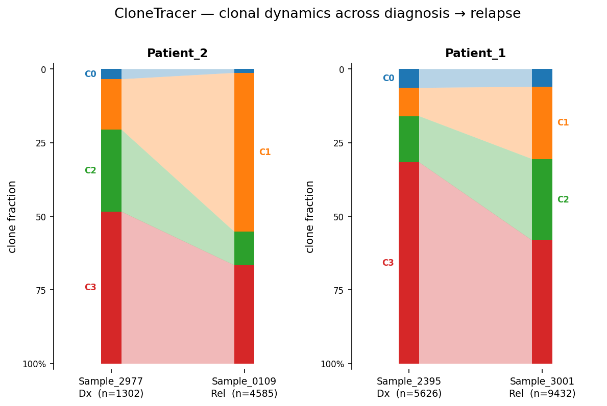

| Patient | Mutation set (model input) | Cells | Dx → Rel shift |
|---|---|---|---|
| **Patient_2** | CNV chr21-del + 3 nuclear SNVs (chr9/chr4/chr8) | 5 887 | **C1 17% → 54%**, C3 52% → 33% |
| **Patient_1** | 4 mtDNA variants (mtDNA-only) | 15 058 | **C1 10% → 25%**, C2 16% → 28%, C3 68% → 42% |

---

## Methods (brief)

- **Input axes per cell (M = mutant, N = reference counts):** CNVs from Numbat consensus segments,
  nuclear SNVs from souporcell genotypes, mtDNA variants from a per-sample cellsnp-lite pileup on chrM.
  Synthesised into one per-patient JSON (`bin/clonetracer_build_json.py`).
- **Mutation cap:** total mutations hard-capped (priority CNV > SNV > mtDNA) at **4** — CloneTracer's
  heuristic tree search is super-exponential in mutation count, so it is designed for a small curated
  driver set, not the full callset.
- **Model:** pyro SVI (`run_clonetracer.py`, pinned pyro 1.8.4 / torch 1.13.1), CPU. Selects the tree
  with the lowest ELBO, then computes per-cell clone posteriors. Clone **C0 = healthy** (root, no mutations).
- **Figures:** ported to Python from the CloneTracer `clonal_inference` R vignette
  (`bin/clonetracer_figures.py`) + reference-map UMAP overlay (`bin/plot_clonetracer_umap.py`).

---

## Patient_2 — CNV + nuclear-SNV + mtDNA (richest case)

Samples: **Sample_2977 (Dx)**, **Sample_0109 (Rel)** · 5 887 cells · selected tree 8 (lowest ELBO).

### Clonal hierarchy
A **branching** hierarchy: a founding clone bearing the chr4 + chr8 SNVs splits into a chr21-deletion
subclone and a chr9-SNV subclone.

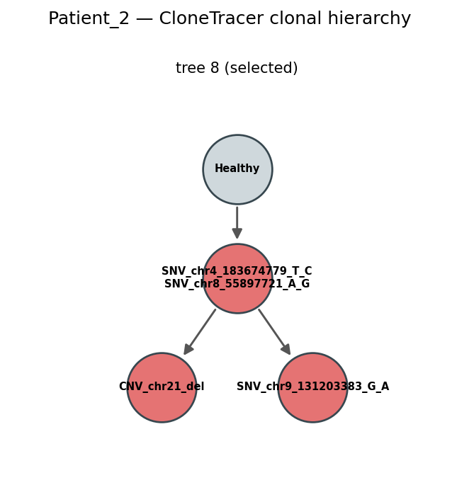

### Single-cell genotype + clone assignment
Per-cell VAF over the four mutations (cells ordered by assigned clone), with clone and
leukaemia-probability side bars — the clones partition the cells into coherent genotype blocks.

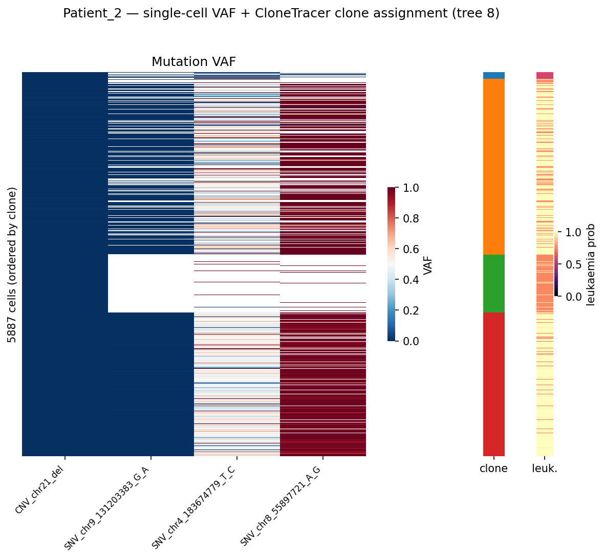

### Clonal dynamics Dx → Rel

| Clone | Dx (n=1302) | Rel (n=4585) |
|---|---|---|
| C0 (healthy) | 3.5% | 1.3% |
| C1 | 17.1% | **53.9%** |
| C2 | 28.0% | 11.5% |
| C3 | 51.5% | 33.4% |

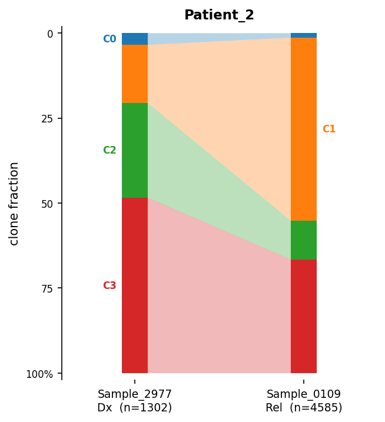

At relapse, **C1 goes from a minor subclone (17%) to the dominant clone (54%)**, while C2 and C3
contract — a clonal selection/expansion pattern.

### Model evidence & spatial overlay

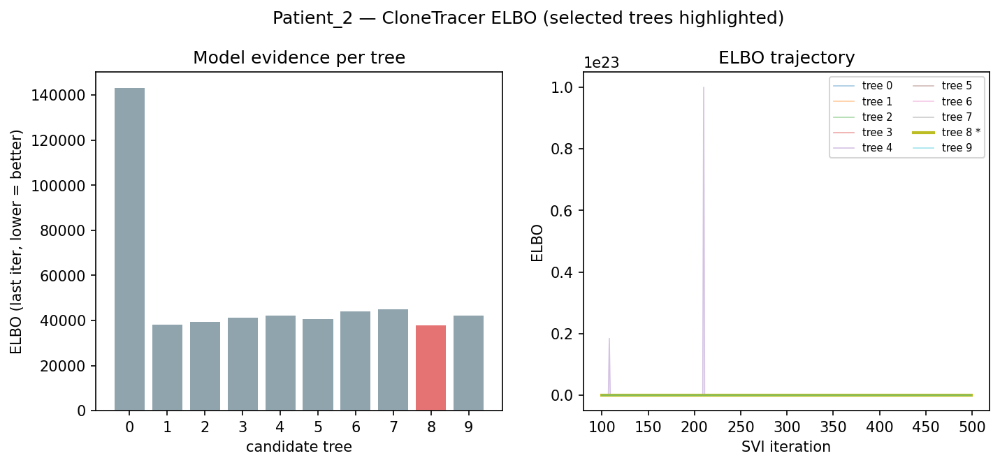

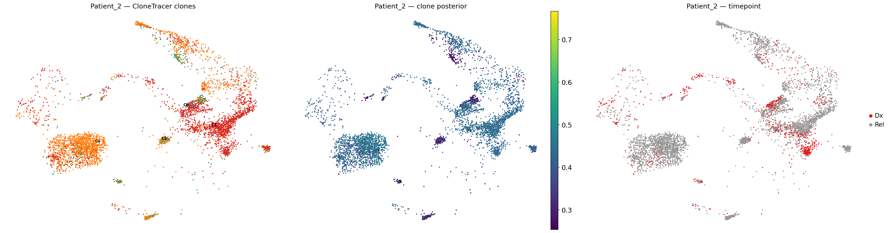

---

## Patient_1 — mtDNA-only

Samples: **Sample_2395 (Dx)**, **Sample_3001 (Rel)** · 15 058 cells. No Numbat `numbat_out` or
souporcell genotypes exist for this patient (see `[[2026-06-22_numbat-specificity]]`), so clones here
are defined by **4 mtDNA variants only** — interpret as mtDNA-heteroplasmy structure rather than a
confirmed malignant hierarchy.

### Clonal hierarchy & genotype

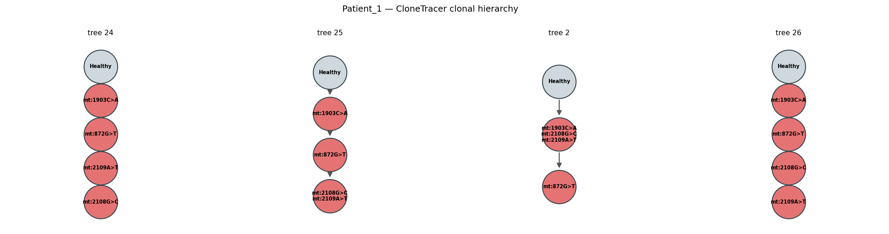

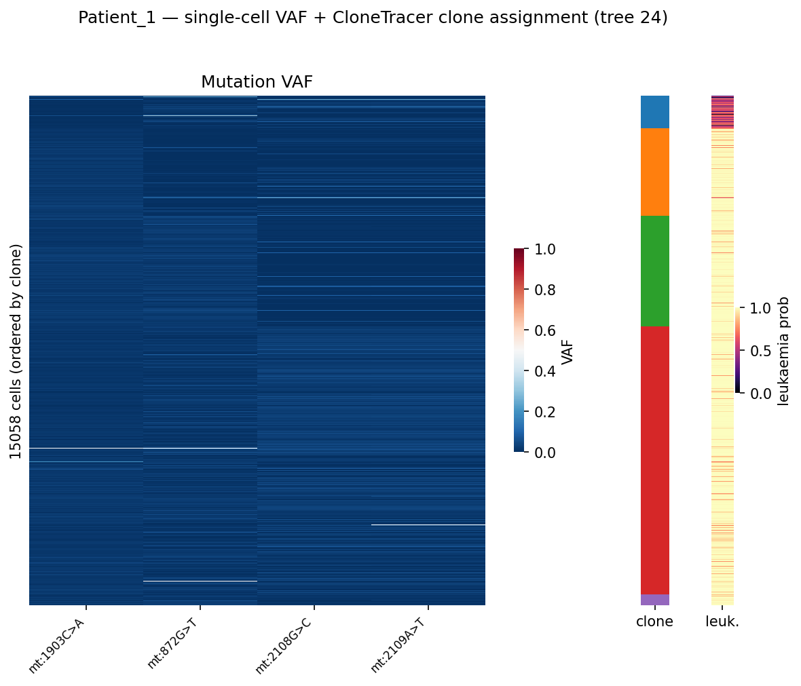

### Clonal dynamics Dx → Rel

| Clone | Dx (n=5626) | Rel (n=9432) |
|---|---|---|
| C0 | 6.4% | 6.0% |
| C1 | 9.6% | **24.5%** |
| C2 | 15.7% | 27.7% |
| C3 | 68.3% | 41.8% |

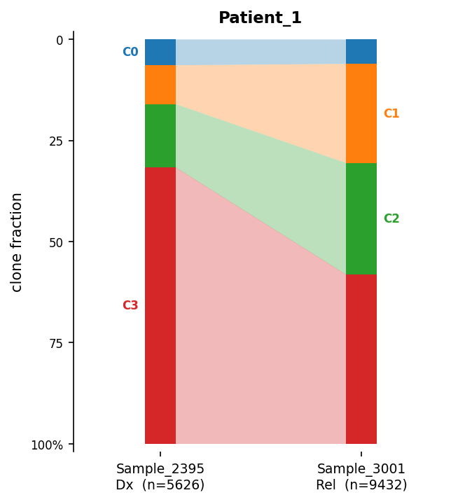

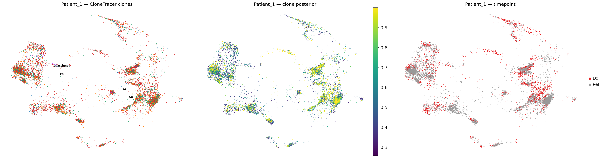

---

## Cohort summary

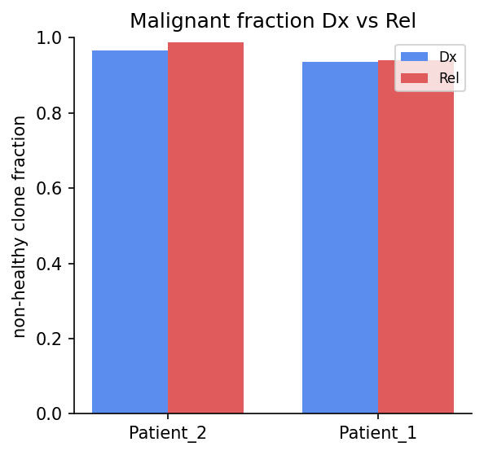

Both patients are overwhelmingly non-healthy (C0 small at both timepoints), as expected for AML bone
marrow; the informative signal is the **redistribution among malignant clones** Dx → Rel shown above.

---

## Caveats

- **Mutation cap (4).** The tree is built on a small curated set; adding more sites is intractable
  (super-exponential tree search) and was the original blocker. Clones are defined relative to this
  set, not the full mutational landscape.
- **Patient_1 is mtDNA-only** — no CNV/SNV axis, so its "clones" reflect mtDNA heteroplasmy; treat as
  exploratory.
- **Standalone run.** Produced off the existing `results_patients/` caller outputs (full-pipeline
  `-resume` was unusable due to upstream task-hash drift), so these outputs are not in the Nextflow
  resume cache. Pipeline wiring (`PLOT_CLONETRACER` now emits these figures) is in place for future
  clean runs.
- Souporcell SNV coverage is inherently sparse in 3′ 10x data (visible as missing VAF rows in the
  Patient_2 heatmap).

---

*Generated from `results_patients/clonetracer/`. Full worklog: `[[2026-06-24_clonetracer-first-runs]]`.
Scripts: `bin/clonetracer_build_json.py`, `bin/run_clonetracer.py`, `bin/clonetracer_figures.py`,
`bin/clonetracer_report_viz.py`, `bin/plot_clonetracer_umap.py`.*
