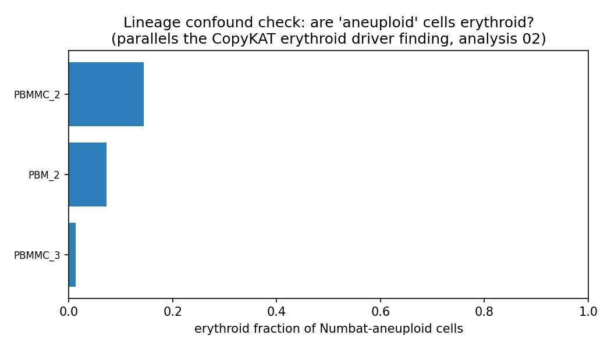
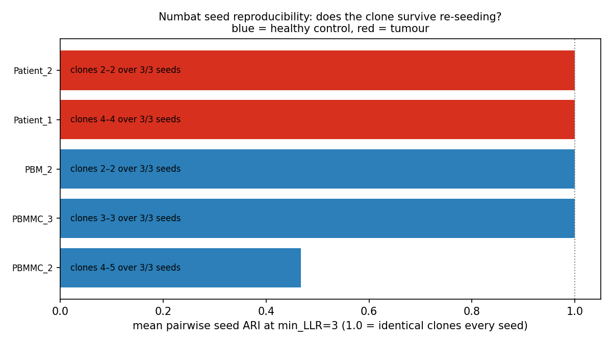
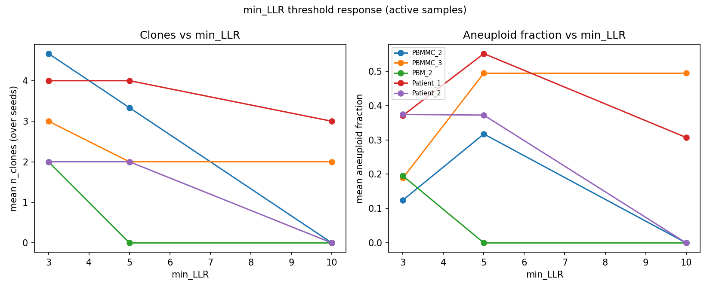

# Numbat robustness: specificity & reproducibility on healthy controls

> **Self-contained report** for the DDE_33 single-cell variant-calling pipeline. Figures live in
> the sibling `figures/` folder (relative embeds, so the whole folder transfers into Obsidian as-is).
> Source lab-book entries: analyses 02 (CopyKAT), 03 (Numbat specificity), 04 (Numbat reproducibility).

## TL;DR

- **Numbat is far more specific than CopyKAT on healthy cells.** On 9 true-normal controls CopyKAT
  called 22–82 % of cells "aneuploid" in *every* sample; **Numbat is silent on 6/9** (no CNV, no clones).
- **When Numbat does over-call (3/9), the calls grade cleanly by confidence (CNV LLR) and reproducibility
  (seed ARI)** — CopyKAT offered neither. Noise calls sit at median LLR 5–8 and/or flip across random
  seeds; real events sit at LLR ≥ 460 and are bit-identical across seeds.
- **Two orthogonal filters cleanly separate signal from noise**, where neither alone can:
  **median segment LLR** (confidence) and **seed ARI** (reproducibility).
- **Operating point adopted: `min_LLR = 5` + a seed-ARI gate** (≥3 seeds, flag mean clone ARI < ~0.9).
- **One labelled-healthy sample (PBMMC_3) carries a genuine CNV** (high LLR, seed-stable, threshold-robust)
  — a finding in its own right, not a Numbat artefact.
- **Infrastructure:** `run_numbat()` peak RAM scales with cells **and** cores; the large Patient_1 joint
  needs ~340 GB (not the 128 GB it was given) — fixing this finally produced its first clone calls.

---

## 1. Background & question

The goal of DDE_33 is to identify leukaemic-stem populations and trace clonal evolution in paired
diagnosis–relapse paediatric AML, defining clones by **genotype** (CNV + SNV + mtDNA). **Numbat** is the
primary clonal axis (CNV from phased allele + expression); **CopyKAT** is a secondary expression-only
aneuploidy gate.

A prior analysis (lab-book **02**) showed CopyKAT is **unreliable on healthy cells**: it called
aneuploidy in 22–82 % of true-normal cells across 9 controls, the call was driven by erythroid/
haemoglobin expression rather than copy number, and it was **not reproducible** (18–98 % of cells flipped
class across a seed × parameter sweep). That raised the obvious question for the primary caller:

> **Is Numbat trustworthy on healthy cells — does it stay silent when there is no tumour (specificity),
> and do its clone calls survive re-seeding and threshold changes (reproducibility)?**

This report answers both, on the same 9 controls plus tumour comparators.

## 2. Data & methods

**Cohort.** 9 GEX-only healthy controls (Caron 2020 GSE132509 PBMMC_1–3; healthy BM HD_BM_1–4; healthy
PBMC PBM_1–2) + paired Dx/Rel AML tumours Patient_1 (Sample_2395 + Sample_3001) and Patient_2
(Sample_2977 + Sample_0109). Numbat run jointly per sample/patient (`run_numbat()`, `max_entropy=0.8`,
`genome=hg38`), reusing the pipeline's per-sample allele-count pileups + Cell Ranger matrices.

**Two analyses:**

1. **Specificity** (single production runs) — `bin/numbat_specificity.py`: per sample, classify
   *silent* (no `segs_consensus` → Numbat filtered out every CNV) vs *called*; for called, summarise
   clones, per-CNV LLR, and an *erythroid fraction* of the aneuploid cells (the CopyKAT confound test).

2. **Reproducibility** (seed × min_LLR sweep) — `bin/numbat_sweep.R` + `bin/numbat_reproducibility.py`:
   re-run `run_numbat()` over a grid of random seeds and `min_LLR` thresholds, reusing existing pileups
   (so only the clone-calling step repeats — it cannot re-draw the production calls). Per-cell clone
   agreement across seeds is the mean pairwise **Adjusted Rand Index (ARI)** (1.0 = identical partition
   every seed).

**Sweep design (why not a full grid).** Factors have different roles — *seed* = replication/nuisance,
*min_LLR* = treatment curve, *sample* = block — so they were **not** fully crossed. Power to detect
instability with R seeds at per-run flip-rate f is `R ≥ ln(β)/ln(1−f)` → **R = 3** gives ~80 % power at
f ≥ 0.5 (gross instability). Combined with the fact that 6/11 samples are silent, a **screen-then-
replicate** allocation was used: full 3 × 3 (seed × min_LLR) on the 5 clone-callers; seeds-only at
production min_LLR on the 6 silent controls → **63 runs** instead of 99, with no loss where the variance
and compute cost live.

---

## 3. Results — specificity

### Numbat is silent on 6/9 healthy controls

Where CopyKAT called aneuploidy in **all 9** controls, Numbat emits **no clones in 6/9** (HD_BM_1–4,
PBMMC_1, PBM_1) — a *principled* silence: it runs the full HMM, then logs *"No CNV remains after
filtering by LLR in pseudobulks"* and declares every chromosome arm diploid.

### The 3 false-positives grade cleanly by CNV LLR

| Sample | group | status | n_clones | aneuploid frac | CNV segs | LLR median | LLR max | erythroid frac |
|---|---|---|---|---|---|---|---|---|
| HD_BM_1–4, PBM_1, PBMMC_1 | healthy | **silent** | 0 | 0 | 0 | — | — | — |
| PBM_2 | healthy | called | 2 | 0.195 | 1 | **4.6** | 4.6 | 0.07 |
| PBMMC_2 | healthy | called | 8 | 0.452 | 8 | **8.1** | 27.3 | 0.14 |
| PBMMC_3 | healthy | called | 3 | 0.189 | 2 | **462.7** | 911.8 | 0.01 |
| Patient_2 | tumour | called | 2 | 0.374 | 2 | **558.4** | 1098.9 | — |
| Patient_1 | tumour | called | 4 | 0.371 | (joint, 51 segs) | (high) | (high) | — |

The per-CNV LLR separates noise from signal by **50–100×**: PBM_2 (4.6) and PBMMC_2 (8) sit on the
`min_LLR` floor, while PBMMC_3 (463) and the tumours (≥558) are orders higher.

### Not the CopyKAT erythroid confound

Unlike CopyKAT (whose aneuploid axis *was* erythroid/haemoglobin expression), Numbat's false-positive
cells are **not** erythroid-enriched (fraction 0.01–0.14; top cell types CD4 T / CLP / PreB). Numbat's
failure mode is statistical over-segmentation of weak pseudobulk signal — a different, LLR-flaggable
error. The two callers fail on different cells for different reasons, which is exactly why the pipeline
keeps both.

---

## 4. Results — reproducibility (seed × min_LLR sweep, 63/63 runs)

### Seed reproducibility at production min_LLR = 3

| Sample | group | seeds called | n_clones | **seed ARI** |
|---|---|---|---|---|
| HD_BM_1–4, PBM_1, PBMMC_1 | healthy | 0/3 | 0 | reproducibly **silent** |
| **PBMMC_2** | healthy | 3/3 | **4–5** (flips) | **0.47** |
| PBM_2 | healthy | 3/3 | 2 | 1.00 |
| PBMMC_3 | healthy | 3/3 | 3 | 1.00 |
| Patient_1 | tumour | 3/3 | 4 | 1.00 |
| Patient_2 | tumour | 3/3 | 2 | 1.00 |

Two clean findings: **(1) specificity is reproducible** — all 6 silent controls are silent in 3/3 seeds
(contrast CopyKAT's 18–98 % cell flips); **(2) only the weakest over-call is seed-unstable** — PBMMC_2
(median LLR 8) has ARI **0.47** with the clone count itself flipping 4↔5. Every other call, including
both tumours, is ARI **1.00**.

### min_LLR threshold response

Mean clones over seeds, by threshold:

| Sample | llr 3 | llr 5 | llr 10 | reading |
|---|---|---|---|---|
| PBM_2 (healthy) | 2 | **0** | 0 | noise — gone at min_LLR ≥ 5 |
| PBMMC_2 (healthy) | 4.7 | 3.3 | **0** | survives to 5 (still seed-unstable); only 10 clears it |
| PBMMC_3 (healthy) | 3 | 2 | **2** | **persists at every threshold** |
| Patient_1 (tumour) | 4 | 4 | 3 | robust |
| Patient_2 (tumour) | 2 | 2 | **0** | real, but **lost at llr10** |

The threshold is **not** a clean universal cut: `min_LLR=5` removes PBM_2's noise while keeping PBMMC_3
and both tumours, but `min_LLR=10` **over-prunes** — it finally kills PBMMC_2's unstable call yet also
wipes a *genuine* tumour (Patient_2). Threshold alone cannot separate PBMMC_2 (noise) from Patient_2
(real) — but **seed ARI can** (0.47 vs 1.00).

### PBMMC_3 is a genuine CNV

PBMMC_3 calls clones at **every** min_LLR (incl. 10), is **perfectly seed-stable** (ARI 1.00), and carries
median LLR 463 — all tumour-like, none artefactual. It carries a **real copy-number event** in a
labelled-healthy cord sample (constitutional/mosaic CNV or sample-quality), and should be excluded from
the "healthy false-positive" set.

---

## 5. Synthesis — the two-filter rule

Numbat's clone call is **far more reproducible than CopyKAT's**, and the instability that exists is
**confined to, and predicted by, the low-LLR calls**. Signal and noise separate on two orthogonal axes:

| Axis | What it catches | Example removed |
|---|---|---|
| **Median segment LLR** (confidence) | weak single CNVs near the floor | PBM_2 (LLR 4.6 → gone at min_LLR ≥ 5) |
| **Seed ARI** (reproducibility) | over-segmented noise no tolerable threshold removes | PBMMC_2 (ARI 0.47) |

Real clones (PBMMC_3, both tumours) pass **both**. CopyKAT, by contrast, offered neither axis — its
per-cell call was a high-variance, lineage-confounded label.

---

## 6. Operational outcomes (wired into the pipeline)

- **`min_LLR` default 3 → 5** (`nextflow.config`): the sweep operating point — drops low-LLR noise,
  retains every real joint clone, and avoids the `min_LLR=10` over-prune that loses a real tumour.
- **Seed-ARI gate (recommended procedure):** run ≥3 seeds per patient and report mean clone ARI; treat
  ARI < ~0.9 as "low-confidence / review" regardless of LLR. (Tooling exists in
  `bin/numbat_reproducibility.py`; automating it in-pipeline needs a multi-seed `NUMBAT_RUN` — pending.)
- **`NUMBAT_RUN` memory fix** (`conf/viking.config`): `run_numbat()` peak RAM scales with cells **and**
  ncores (forked workers). Measured: single-sample tree-building joints ~100–130 GB; the **Patient_1
  paired joint (15,097 cells) peaked at 341 GB**. It was being given 128 GB → always OOM'd, which is why
  **Patient_1's `NUMBAT_RUN` never finished** before. Now floored at 200 GB × attempt @ 8 cores; the
  canonical run completed in 5 h 18 m and produced **4 clones** (matching the sweep, ARI 1.0). Tumour
  positive class raised n=1 → n=2.

---

## 7. Limitations

- **Tumour comparators are n=2** (Patient_1, Patient_2); the 10 DDE_22 patients remain pileup-only
  (same memory cause — to be re-run with the fix).
- **3 seeds** detects gross instability (f ≥ 0.5) but not subtle (f ≈ 0.2, would need ~8 seeds);
  samples at ARI 1.0 across 3 seeds could still have rare-cell instability a larger sweep would surface.
- **Only min_LLR was swept** (max_entropy fixed at 0.8); the entropy axis is untested.
- **PBMMC_3's CNV is uncharacterised** — flagged as genuine but its actual segments not yet inspected.
- Aneuploid fraction uses `p_cnv > 0.5` vs the most-populous (reference) clone.

---

## 8. Provenance & artifacts

- **Code:** `bin/numbat_specificity.py`, `bin/numbat_sweep.R`, `bin/numbat_sweep_manifest.py`,
  `bin/numbat_reproducibility.py`, `jobs/numbat_sweep*.sh`, `jobs/numbat_patient1_canonical.sh`.
- **Results:** `results_controls/numbat_specificity/`, `results_controls/numbat_robustness/_analysis/`,
  `results_patients/numbat_joint/{Patient_1,Patient_2}/numbat_out/`.
- **Lab book:** analyses `03_numbat_specificity`, `04_numbat_reproducibility`; sessions
  `2026-06-22_numbat-specificity`, `2026-06-23_numbat-sweep`.
- **Compute (Viking, SLURM, `numbat.sif` via apptainer):** sweep array `35140733` + hi-mem rerun
  `35176483` (63 combos); Patient_1 canonical `35240803` (341 GB, 5 h 18 m).
- **Git:** branch `numbat-specificity-reproducibility`, commit `4340c01`.
